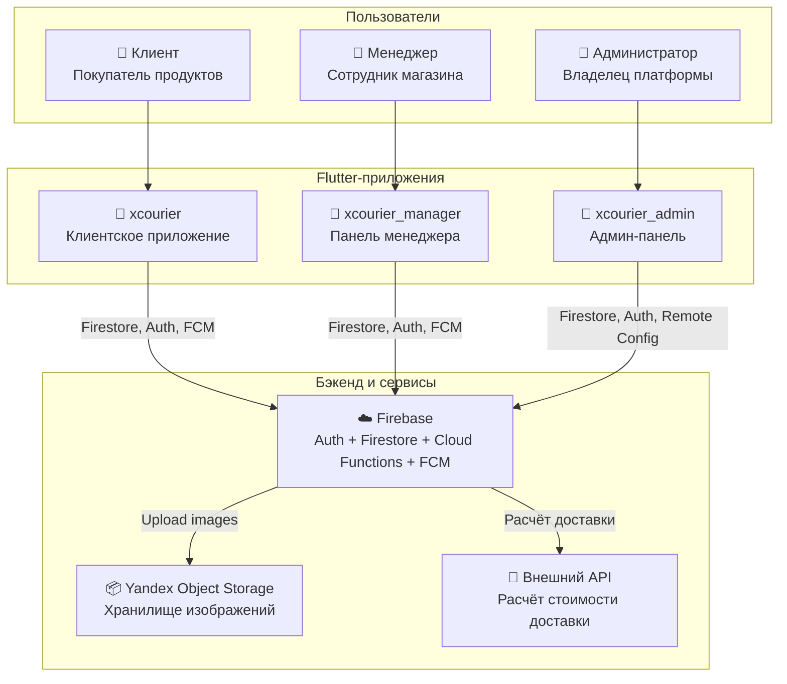
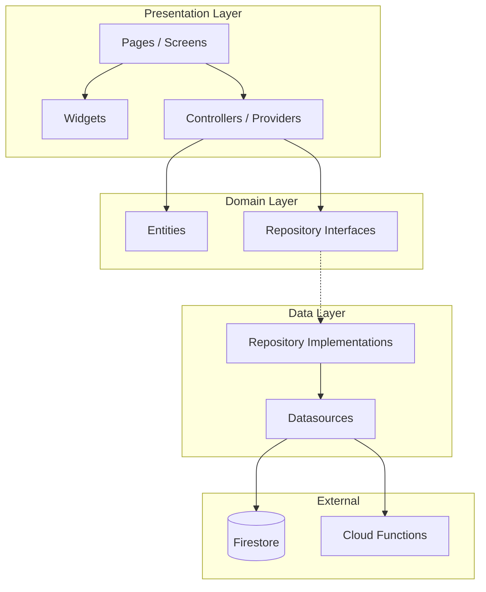
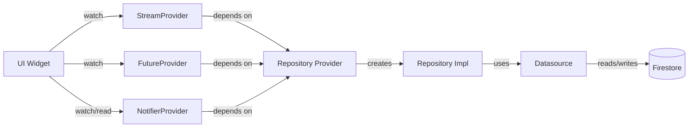
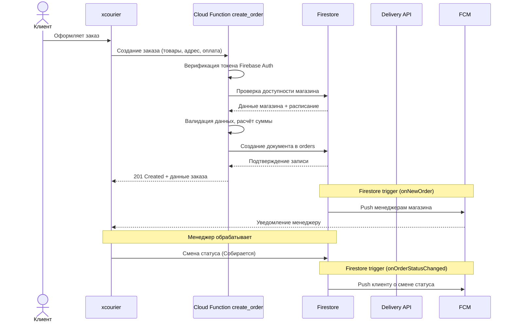
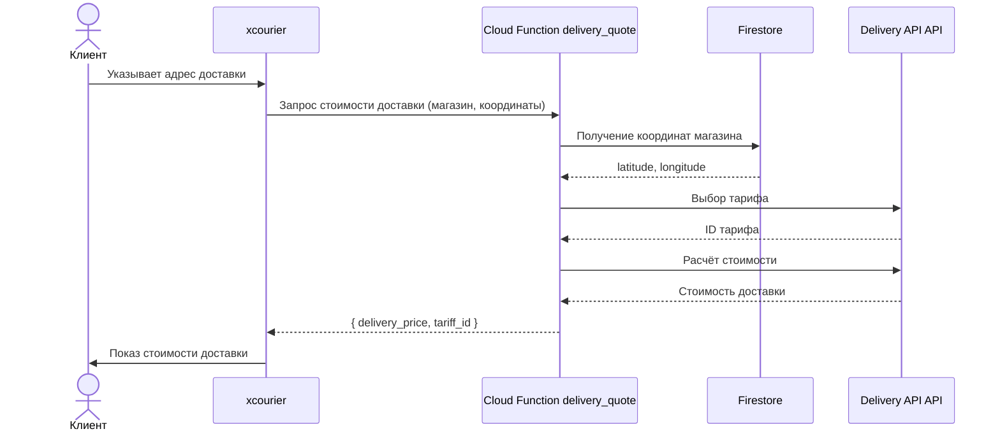

# Архитектура

## Общая архитектура системы



## Архитектура Flutter-приложений

Все три приложения следуют паттерну **Feature-first + Clean Architecture**:



### Слои

| Слой | Ответственность | Примеры |
|---|---|---|
| **Presentation** | UI, взаимодействие с пользователем, управление состоянием | Pages, Widgets, Riverpod Controllers |
| **Domain** | Бизнес-логика, сущности, контракты | Entities (Freezed), Repository interfaces |
| **Data** | Реализация работы с данными | Firestore datasources, Repository implementations |

### Направление зависимостей

- Presentation зависит от Domain (использует entities и repository interfaces)
- Data зависит от Domain (реализует repository interfaces)
- Domain не зависит ни от чего (чистый Dart)

## State Management (Riverpod)



| Тип провайдера | Применение |
|---|---|
| `StreamProvider.autoDispose` | Real-time данные из Firestore |
| `FutureProvider.autoDispose.family` | Async загрузка с параметрами |
| `NotifierProvider` | Мутируемое состояние (auth, формы) |
| `NotifierProvider.autoDispose` | Локальный UI стейт страницы |
| `Provider` | Зависимости / репозитории |

В `xcourier_admin` дополнительно используется `riverpod_annotation` + `riverpod_generator` для type-safe провайдеров через кодогенерацию.

## Обработка ошибок

Все data-операции возвращают `Result<T>` — sealed type:

```dart
Result<T>
├── Success(value: T)
└── FailureResult(failure: Failure)

Failure
├── ServerFailure
├── AuthFailure
├── NetworkFailure
├── NotFoundFailure
└── UnknownFailure
```

Использование:
```dart
result.when(
  success: (value) => // обработка успеха,
  failure: (failure) => // обработка ошибки,
);
```

## Процесс создания заказа



## Процесс расчёта доставки


