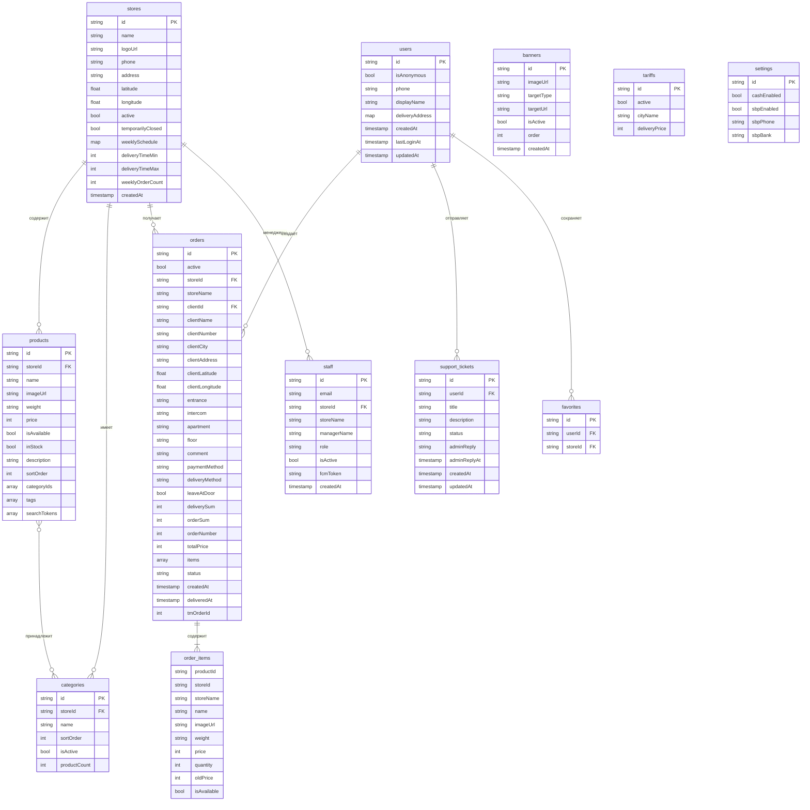

# База данных

## Обзор

Проект использует **Cloud Firestore** в качестве основной базы данных. Firestore — документо-ориентированная NoSQL БД с поддержкой real-time синхронизации.

- **Проект:** указан в `firebase_options.dart`
- **Регион:** Europe

## ER-диаграмма

## Коллекции Firestore

### `stores` — Магазины

Магазины платформы с адресом, координатами, расписанием и настройками.

| Поле | Тип | Описание |
|---|---|---|
| `id` | string | ID документа |
| `name` | string | Название магазина |
| `logoUrl` | string | URL логотипа |
| `phone` | string | Телефон |
| `address` | string | Адрес |
| `latitude`, `longitude` | number | Координаты (для расчёта доставки) |
| `active` | boolean | Виден ли в клиентском приложении |
| `temporarilyClosed` | boolean | Временно закрыт (вручную) |
| `weeklySchedule` | map | Расписание по дням недели |
| `deliveryTimeMin`, `deliveryTimeMax` | number | Время доставки в минутах |
| `weeklyOrderCount` | number | Счётчик заказов за неделю |

### `products` — Товары

| Поле | Тип | Описание |
|---|---|---|
| `id` | string | ID документа |
| `storeId` | string | ID магазина-владельца |
| `name` | string | Название |
| `imageUrl` | string | URL изображения (WebP в Yandex S3) |
| `weight` | string | Вес/объём |
| `price` | number | Цена в тенге |
| `isAvailable` | boolean | Отображается в каталоге |
| `inStock` | boolean | Есть в наличии |
| `categoryIds` | array\<string\> | ID категорий (мультикатегориальность) |
| `tags` | array\<string\> | Теги для поиска |
| `searchTokens` | array\<string\> | Токены полнотекстового поиска (генерируются Cloud Function) |
| `sortOrder` | number | Порядок сортировки |
| `description` | string | Описание |

### `categories` — Категории товаров

| Поле | Тип | Описание |
|---|---|---|
| `id` | string | ID документа |
| `storeId` | string | ID магазина |
| `name` | string | Название категории |
| `sortOrder` | number | Порядок |
| `isActive` / `isEnabled` | boolean | Активна ли |
| `productCount` | number | Количество товаров (admin) |

### `orders` — Заказы

Заказы содержат встроенный массив `items` (денормализация для быстрого чтения).

Статусы: `Создан` → `Собирается` → `Собран` → `В пути` → `Завершен` | `Отменен`

### `users` — Пользователи

Клиенты приложения xcourier. Включают вложенный объект `deliveryAddress` с деталями адреса.

### `staff` — Персонал (менеджеры)

| Поле | Тип | Описание |
|---|---|---|
| `role` | string | Роль (`manager`) |
| `storeId` | string | Привязка к магазину |
| `isActive` | boolean | Активен (может быть заблокирован) |
| `fcmToken` | string | Токен для push-уведомлений |

### `support_tickets` — Обращения

Статусы: `open` → `in_progress` → `closed`

### `banners` — Рекламные баннеры

`targetType`: `none` (просто картинка), `web` (внешняя ссылка), `store` (переход к магазину)

### `tariffs` — Тарифы на доставку

Фиксированные тарифы для городов без динамического расчёта доставки.

### `settings` — Глобальные настройки

Документ `payment` в коллекции `settings` — настройки способов оплаты.

## Правила безопасности

- Менеджеры видят только данные своего магазина (фильтр по `storeId`)
- Клиенты видят только публичные данные (магазины, товары, баннеры) и свои заказы/тикеты
- Администраторы имеют полный доступ
- Создание заказов — через Cloud Function (серверная валидация)
