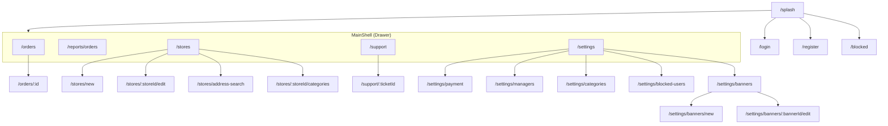

# xcourier_admin — Обзор

Административная панель для управления всеми аспектами платформы.

## Технологии

- Flutter + Riverpod
- `riverpod_annotation` + `riverpod_generator` (кодогенерация провайдеров)
- GoRouter (ShellRoute с Drawer)
- Freezed + json_serializable
- Firebase Auth, Firestore, Remote Config
- Equatable (для моделей отчётов)

## Особенности

- **Riverpod Generator** — type-safe провайдеры через аннотации (`@riverpod`)
- **ShellRoute** — единый Drawer для всех внутренних экранов
- **Remote Config** — управление force update, maintenance mode, connectivity
- **Отчёты** — аналитика заказов с группировкой по магазинам и способам оплаты
- **Именованные маршруты** — все пути в `AppRoutes` (абстрактный final class)
- **Auth flow** — 4 состояния: initial, authenticated, unauthenticated, blocked

## Навигация

