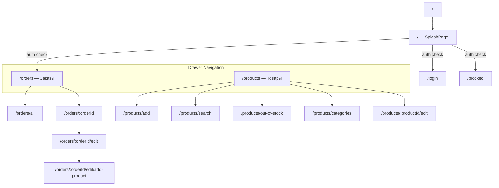

# xcourier_manager — Обзор

Панель менеджера магазина. Обработка заказов и управление ассортиментом.

## Технологии

- Flutter + Riverpod
- GoRouter (с auth redirect)
- Freezed + json_serializable
- Firebase Auth (email/password)
- Cloud Firestore (real-time StreamProviders)
- Firebase Cloud Messaging (push при новых заказах)

## Особенности

- **Auth guard** — GoRouter `redirect` проверяет авторизацию на каждом переходе. Неавторизованные перенаправляются на `/login`, заблокированные — на `/blocked`.
- **Real-time заказы** — заказы грузятся через `StreamProvider`, обновляются мгновенно.
- **Привязка к магазину** — менеджер видит только данные своего магазина (`storeId`).
- **Переходы без анимации** — при смене разделов через Drawer используется `CustomTransitionPage` с `Duration.zero`.

## Навигация

